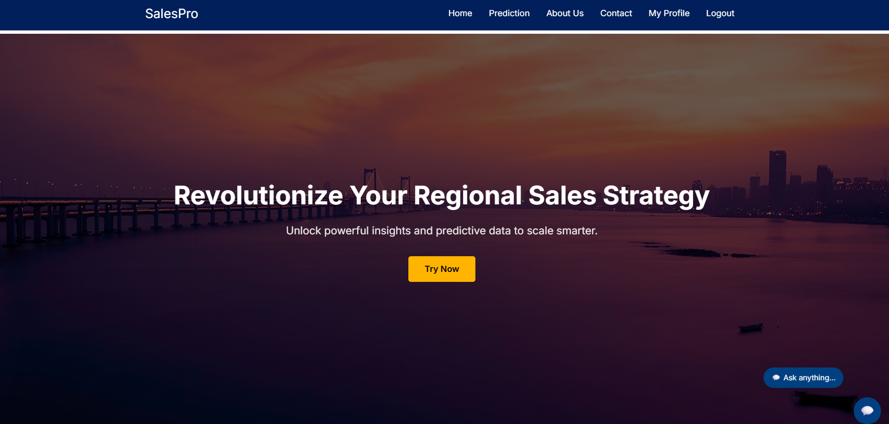
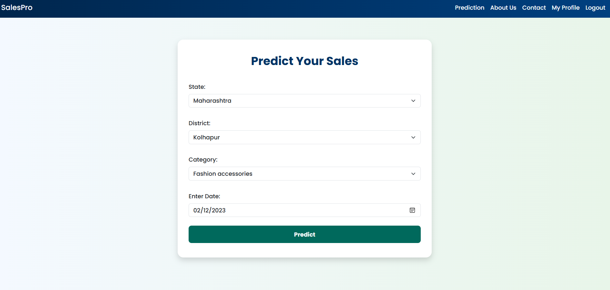
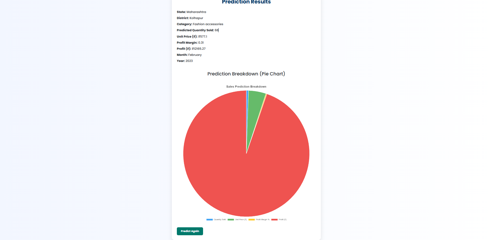
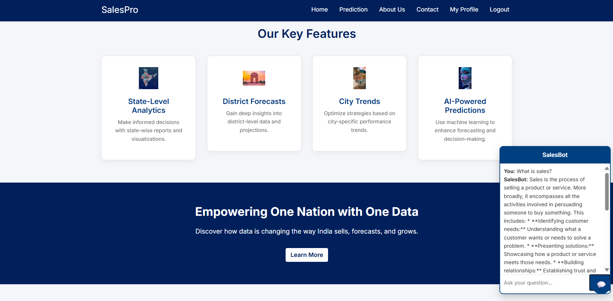

# 💼 SalesPro: Budget & Sales Prediction Web App

**SalesPro** is a full-featured web application for predicting and analyzing sales and budget data across multiple regions. Designed for professionals, sales teams, and analysts, SalesPro delivers AI-powered insights by forecasting key financial metrics like quantity sold, unit price, profit margin, and total profit — based on region and product category.

---

## 🚀 Features

✅ **Region-wise Sales Prediction**  
Predicts sales based on selected state, district, and product category using trained machine learning models.

✅ **Profit & Quantity Forecasting**  
Estimates values such as:
- Quantity Sold  
- Unit Price (₹)  
- Profit Margin  
- Total Profit (₹)

✅ **Dynamic Form UI**  
Interactive dropdowns for `State`, `District`, and `Category` that dynamically update based on user selection.

✅ **User Dashboard-Like Homepage**  
A professional landing page with:
- Hero banner
- AI feature highlights
- Realistic customer reviews slider
- Scrollable features with visual insights
- Chatbot prompt & floating assistant

✅ **Built-in Chatbot**  
Includes a custom chatbot (SalesBot) that responds to queries related to sales, budgeting, and platform navigation.

✅ **Admin/User Routing Support**  
Modular Flask routes for:
- Home  
- Prediction  
- About  
- Contact  
- Profile  
- Logout

✅ **Modern UI/UX**  
Fully responsive and styled with:
- Bootstrap 4  
- Custom CSS  
- Unsplash professional imagery  
- Animated hover and scroll interactions

---

## 🧠 Technologies Used

- **Python 3** & **Flask** (Web Framework)
- **scikit-learn** (ML Models)
- **pandas** (Data preprocessing)
- **Jinja2** (HTML Templating)
- **Bootstrap 4** (Frontend UI)
- **JavaScript** (Chatbot + Interactions)
- **HTML/CSS** (Design)

---

## 🧠 Machine Learning Model

SalesPro uses **four separate Random Forest Regressors**, trained to predict:

1. `Quantity Sold`  
2. `Unit Price (₹)`  
3. `Profit Margin`  
4. `Profit (₹)`

Inputs used:  
- `State`  
- `District`  
- `Category`

All models and label encoders are saved as `.pkl` files and loaded at runtime using `joblib`.

---

## 📁 Project Structure

SalesPro/
│
├── app.py # Main Flask app
├── /templates/
│ └── home.html # Beautiful UI homepage
│ └── prediction.html # Sales prediction form
│ └── result.html # Result page
│
├── /static/
│ └── style.css # Custom CSS
│
├── /models/
│ └── model_quantity.pkl # Trained ML models
│ └── model_price.pkl
│ └── model_margin.pkl
│ └── model_profit.pkl
│ └── label_encoders.pkl
│
├── Final_professional_sales_dataset.xlsx # Original dataset
└── README.md


---

## 🧪 How to Run

1. Install dependencies  
   ```bash
   pip install flask pandas scikit-learn joblib
   
2. Run the app
    ```bash
    python app.py

3. Visit in browser
   ```bash
   http://127.0.0.1:5000

## 🖼 Screenshots

### 🏠 Home Page


### 📋 Predict Form


### 📊 Result Page


### 💬 Chatbot Interaction


💬 Chatbot Tips
Ask the bot things like:

"What is the sales prediction?"

"Show me budget trend."

"How do I use the platform?"

  
